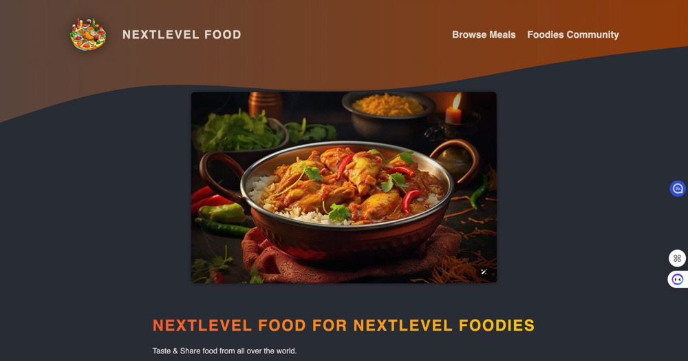
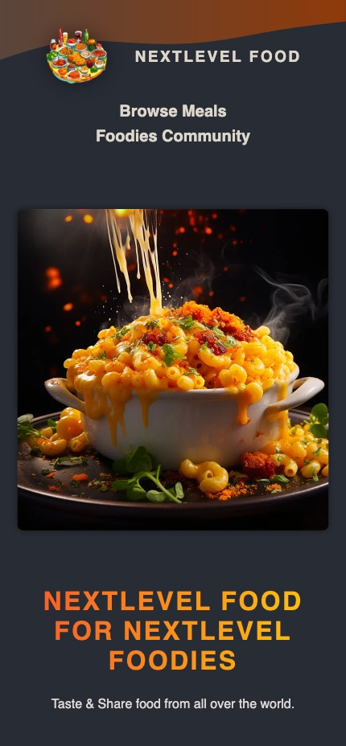

# 🍔 Foodies – Responsive Restaurant Discovery App

**Foodies** is a responsive full-stack food discovery app that lets users browse meals by category, rating, and location.  
Built with **Next.js App Router**, **React**, and **TypeScript**, and styled using **CSS Modules**.

Deployed on **Vercel** | Local data via **SQLite**

---

## 🌐 Live Demo & Code

🔗 [Live Demo](https://next-js-and-react-woad.vercel.app)  
📂 [GitHub Repo](https://github.com/TheClaireLiu/Next.js-and-React/tree/master/05-onwards-foodies-starting-project)

---

## ✨ Key Features

- ✅ Fully responsive layout (mobile → desktop)
- ✅ Animated image slideshow
- ✅ Category-based filtering
- ✅ Clean UI and accessible component structure
- ✅ TypeScript refactoring
- ✅ Image upload support via **AWS S3**
- ✅ Backend logic powered by **SQLite** (`better-sqlite3`)
- ✅ Deployed on **Vercel**
- 🔐 *Coming soon*: Authentication and backend integration

---

## 🖼️ Screenshots

  

  

---

## 🛠 Tech Stack

| Layer        | Tools/Tech                            |
|--------------|----------------------------------------|
| Frontend     | Next.js 13+ (App Router), React, TypeScript |
| Styling      | CSS Modules                            |
| Database     | SQLite (local)                         |
| Deployment   | Vercel                                 |
| Upcoming     | Authentication (NextAuth), MongoDB     |

---

## 📌 Project Status

> ✅ **Finalized UI + Responsive design + TypeScript migration**  
> 🔄 *Currently integrating authentication and backend*  
> 📊 Tracked with Vercel Analytics (0% error rate over 300+ requests)

---

## 👩‍💻 Author

**Claire Liu**  
🎓 Final-semester Web Dev student 
🌍 Based in Ottawa, Canada | Open to remote internships & entry-level roles

- 🔗 [LinkedIn](https://www.linkedin.com/in/wanying--liu/)
- 🐙 [GitHub](https://github.com/TheClaireLiu)
- 📧 cliu202211@gmail.com